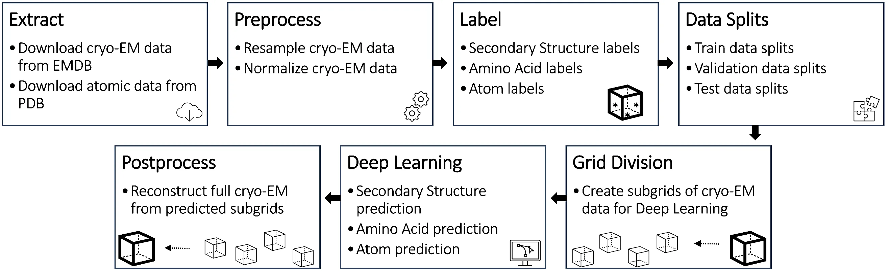

# Cryo2StructData: A Large Labeled Cryo-EM Density Map Dataset for AI-based Modeling of Protein Structures 

<div align="center">
	
[](https://doi.org/10.1038/s41597-024-03299-9)  [![CC BY 4.0][cc-by-shield]][cc-by]

[cc-by]: http://creativecommons.org/licenses/by/4.0/
[cc-by-image]: https://i.creativecommons.org/l/by/4.0/88x31.png
[cc-by-shield]: https://img.shields.io/badge/License-CC%20BY%204.0-lightgrey.svg

</div>

Cryo2StructData is a dataset for AI-based modeling of protein structures from cryo-EM density maps. The programs for generating this dataset are included in this repository for users to reproduce the process of generating data or create customized datasets. The repository also contains all the necessary code, instructions, and trained models to reproduce the aotmic structure building protocol. The data preparation and validation pipeline for the Cryo2StructData is described in the figure below.




## Dataset Download
To keep the data files of Cryo2StructData permanent, we published all data to the Harvard Dataverse (https://dataverse.harvard.edu/dataverse/Cryo2StructData), an online data management and sharing platform with a permanent Digital Object Identifier number for each dataset. 

The Cryo2StructData Dataverse comprises the Full Cryo2StructData (https://doi.org/10.7910/DVN/FCDG0W) along with its associated trained deep transformer model and data split (https://doi.org/10.7910/DVN/SXNYRE). Similarly, within the Cryo2StructData Dataverse, you will find the Small Subsample (https://doi.org/10.7910/DVN/CGUENL) of the complete Cryo2StructData companied by its respective trained deep transformer model and data splits (https://doi.org/10.7910/DVN/DTV4JF). Finally, the test dataset can be access here: https://doi.org/10.7910/DVN/2GSSC9 .

## Description of the dataset
The dataset can be accessed using the above dataset download link. The protein structures and cryo-EM density maps can be visualized using tools such as: [UCSF ChimeraX](https://www.cgl.ucsf.edu/chimerax/index.html). The dataset follows the format described below, and please read the subsequent section describing what these data mean.
```text
cryo2struct
├── metadata.csv
├── splits.csv
|── root
    ├── full_dataset
        │── EMD_0
           │── 0004
             │-- emd_0004.map
             |-- emd_normalized_map.mrc
             |-- atom_emd_normalized_map.mrc
             |-- atom_ca_emd_normalized_map.mrc
             |-- amino_emd_normalized_map.mrc
             |-- sec_struc_emd_normalized_map.mrc
             |-- 6giq.pdb
             |-- 6giq_helix.pdb
             |-- 6giq_coil.pdb
             |-- 6giq_strand.pdb
             |-- 6giq.fasta
             |-- 6giq_all_chain_combined.fasta
             |-- atomic.fasta
             |-- dealign_clustal_input.fasta
             |-- dealign_clustal_output.fasta
          │── 0031
             │-- emd_0031.map
             |-- emd_normalized_map.mrc
             |-- atom_emd_normalized_map.mrc
             |-- atom_ca_emd_normalized_map.mrc
             |-- amino_emd_normalized_map.mrc
             |-- sec_struc_emd_normalized_map.mrc
             |-- 6gmh.pdb
             |-- 6gmh_helix.pdb
             |-- 6gmh_coil.pdb
             |-- 6gmh_strand.pdb
             |-- 6gmh.fasta
             |-- 6gmh_all_chain_combined.fasta
             |-- atomic.fasta
             |-- dealign_clustal_input.fasta
             |-- dealign_clustal_output.fasta

        │── EMD_1
           │── 11150
             │-- emd_11150.map
             |-- emd_normalized_map.mrc
             |-- atom_emd_normalized_map.mrc
             |-- atom_ca_emd_normalized_map.mrc
             |-- amino_emd_normalized_map.mrc
             |-- sec_struc_emd_normalized_map.mrc
             |-- 6zbc.pdb
             |-- 6zbc_helix.pdb
             |-- 6zbc_coil.pdb
             |-- 6zbc_strand.pdb
             |-- 6zbc.fasta
             |-- 6zbc_all_chain_combined.fasta
             |-- atomic.fasta
             |-- dealign_clustal_input.fasta
             |-- dealign_clustal_output.fasta
          │── 10040
             │-- emd_10040.map
             │-- emd_normalized_map.mrc
             |-- ...
             |-- ...

       │── EMD_2
          │── 20060
             │-- emd_20060.map
             │-- emd_normalized_map.mrc
             |-- ...
             |-- ...
          │── ...
    
       │── EMD_3
          │── 3099
            │-- emd_3099.map
            │-- emd_normalized_map.mrc
            |-- ...
            |-- ...

       │── ...

    .
    .
    .

```
In the Cryo2StructData Dataverse, an Excel sheet named as `` metadata.csv `` contains the relevant information for each cryo-EM density map present in Cryo2StructData dataset. Specifically, each row of the sheet contains the EMD ID of the density map, it's corresponding PDB code, density map's resolution, structure determination method, the software used to determine the density map, the title and the journal of the article describing the density maps. 

In the Full Cryo2StructData directory (https://doi.org/10.7910/DVN/FCDG0W), there are 10 subdirectories, corresponding to 10 folds of the curated training density maps (EMD_0, ..., EMD_9). As shown in the example data format above, each individual sub-directory for a cryoEM density map in a fold provides the following data files:

- ``emd_0004.map`` : Original cryo-EM density map with EMD ID as its suffix, in this case; 0004.
- ``emd_normalized_map.mrc`` : Normalized cryo-EM denisty map.
- ``atom_emd_normalized_map.mrc`` : Atoms lableled cryo-EM density map.
- ``atom_ca_emd_normalized_map.mrc`` : Carbon-alpha (Cα) atoms only labeled cryo-EM density map. Users need to use script provided in this repository to generate this labeled map.
- ``amino_emd_normalized_map.mrc`` : Amino acids labeled cryo-EM density map. Users need to use script provided in this repository to generate this labeled map.
- ``sec_struc_emd_normalized_map.mrc`` : Secondary structure labeled cryo-EM density map. Users need to use script provided in this repository to generate this labeled map.
- ``6giq.pdb`` : PDB file of the cryo-EM density.
- ``6giq_helix.pdb`` : Extracted helices from the PDB file.
- ``6giq_coil.pdb`` : Extracted coils from the PDB file.
- ``6giq_strand.pdb`` : Extracted strands from the PDB file.
- ``6giq.fasta`` : Original protein sequence in the FASTA format.
- ``6giq_all_chain_combined.fasta`` : Combined sequence of all chains, provided in FASTA format for the original sequence.
- ``atomic.fasta``: Sequence extracted from the PDB structure in FASTA format.
- ``dealign_clustal_input.fasta`` : Input for Clustal Omega tool.
- ``dealign_clustal_output.fasta`` : Alignment between original sequence and the sequence extracted from the protein structure generated by Clustal Omega tool in FASTA format.

## Setup Environment
If you want to generate the dataset by yourself, please set up the environment using Anaconda.

Here is an example to set up a working conda environment to run the code.

```
conda env create -f cryo2struct.yml
conda activate cryo2struct
```

Additionally, the pipeline requires [UCSF ChimeraX](https://www.cgl.ucsf.edu/chimerax/index.html) to resample the density map and extract secondary structures from the ``.pdb`` file in non-GUI mode. The pipeline also requires [Clustal Omega](http://www.clustal.org/omega/#Documentation) to be installed on the system for running the alignment between original sequence and atomic seqeunce. If user wants to skip the alignment process, then the installation of Clustal Omega is not required. We used ChimeraX 1.4-1 in CentOS 8 system.

## Programs to generate the dataset

1. To extract the data, run the command shown below from the preprocessing directory. In the bash script, include the names of the density maps you want to download from the [EMDB](https://www.emdataresource.org/index.html) website. The python scripts download PDB and FASTA files from the [RCSB](https://www.rcsb.org/) website.
```
bash fetch_EMDB_maps.sh
python3 get_pdb_from_rcsb.py
python3 get_fasta_from_rcsb.py
```

Make sure that the cryo-EM density map in ``.map`` format, the corresponding PDB file in ``.pdb`` format, and the original sequence in ``.fasta`` format are present for each individual cryo-EM density map in the specified ``absolute input path``. The data preparation programs can be run as shown below: 

2.  Run resample map program:

```
python3 get_resample_map.py <absolute input path> <chimera_path>
```
The ``absolute input path`` is the directory where cryo-EM density maps are present (example: path to EMD_0). If the UCSF chimera's path is different than ``/usr/bin/chimerax``, then please enter the correct path.

3. Run normalize map program:
```
python3 get_normalize_map.py <absolute input path>
```
The ``absolute input path`` is the directory where cryo-EM density maps are present (example: path to EMD_0). Normalization step uses resampled map.

4. Run labeling programs:

The atoms and amino acid labeling program can be run as:
```
python3 get_atoms_label.py <absolute input path>
python3 get_amino_labels.py <absolute input path>
```
 
Run the below if `{emd_id}_coil.pdb`, `{emd_id}_helix.pdb`, and `{emd_id}_strand.pdb` are not present in the files downloaded from Cryo2StructData dataverse or you are reproducing the label generation process. The below program extracts coils, helices, and strands using [UCSF ChimeraX](https://www.cgl.ucsf.edu/chimerax/index.html) in no-GUI mode and saves them as seperate ``.pdb`` files. 
```
python3 get_secondary_pdb.py <absolute input path>
```
Run the below to generate the label mask maps for secondary structure. The programs below use the above generated `{emd_id}_coil.pdb`, `{emd_id}_helix.pdb`, and `{emd_id}_strand.pdb` files to generate a single labeled MRC file.
```
python3 get_sec_stru_coil_label.py <absolute input path>
python3 get_sec_stru_helix_label.py <absolute input path>
python3 get_sec_stru_strand_label.py <absolute input path>
```
The ``get_sec_stru_coil_label.py`` program creates a new ``.MRC`` file and labels coils as 1, the other programs reopens the saved ``.MRC`` file and labels 2 for helices and 3 for strands. Make sure to run the programs in sequence as provided. The ``absolute input path`` is the directory where cryo-EM density maps are present. Labeling programs use normalized map.

5. Extract atomic sequence and align with original sequence:

We generate the alignment between the original sequence and the sequence extracted from the protein structure generated by [Clustal Omega](http://www.clustal.org/omega/#Documentation). First, we extract the atomic sequence from the protein structure (``.pdb``) file. Then, we combine the sequences of all chains with the original sequence. Finally, we align them using [Clustal Omega](http://www.clustal.org/omega/#Documentation).

```
python3 merge_chains_fasta.py <absolute input path>
python3 get_pdb_seq.py <absolute input path>
python3 make_input_run_clustal.py <absolute input path>
```
The ``absolute input path`` is the directory where cryo-EM density maps are present. Make sure to run the programs in sequence as provided.

6. Grid division of density maps:

We perform grid division of the density maps for deep learning training and inference step.
```
python3 grid_division.py <absolute input path>
```

The ``absolute input path`` refers to the directory where cryo-EM density maps are located. During grid division, a new directory is created in the parent directory of the ``absolute input path``, and the grid division results for each individual map are saved as numpy arrays. These arrays are used in both the training and inference steps to predict the protein structure.

**Run all at once:**

The entire data preparation pipeline can be easily run by:

```
bash run_data_preparation.bash ../example
```
 In the above example ``../example`` is the ``absolute input path``. Due to the file size limitation, the cryo-EM density map of EMD 22898 is not available in [example/22898/](example/22898) directory. EMD 22898 map can be downloaded from [here](https://www.emdataresource.org/EMD-22898), keep the map in [example/22898/](example/22898) and then run the above bash command.

## Programs to validate the dataset
We validated data processing pipeline as decribed in Section 5 of the paper by using the scripts:


(a) Resampling:
```
python3 validation/resampling_validation.py
```
(b) Normalizaion:
```
python3 validation/normalization_validation.py
```
(c) Labeling:
```
python3 validation/labeling_validation.py
```
(d) Compliance with MRC2014 Format:
```
python3 validation/validate_mrc.py
```


## Programs to validate the dataset using deep learning
To validate the utility and quality of Cryo2StructData, we designed two deep transformer models and trained and tested them on Cryo2StructData to predict backbone atoms and amino acid types from density maps. We have released the source code for training and validation of these deep learning models, which is available here: https://github.com/jianlin-cheng/Cryo2Struct . The paper describing the method in detail is available here: [Cryo2Struct](https://doi.org/10.1038/s41467-024-49647-6) . You can model the protein structures by following the steps below or refer to the steps provided here:  https://github.com/jianlin-cheng/Cryo2Struct (<font color="green">**Highly Recommended**</font>).

### Deep transformer to predict protein backbone atoms and amino acid types
The inference program for the deep transformer is available in [prediction/src/infer/](prediction/src/infer/). Download the model checkpoints from [Trained on Full Cryo2StructData](https://doi.org/10.7910/DVN/SXNYRE) or [Trained on Small Subset Cryo2StructData](https://doi.org/10.7910/DVN/DTV4JF) and keep them in [prediction/checkpoints](prediction/checkpoints/) directory.

### Hidden Markov Model (HMM) to link predicted carbon-alpha atoms into backbone structures
The Hidden Markov Model-Guided carbon-alpha atom connection program are available in [prediction/src/viterbi/](prediction/src/viterbi/). The viterbi algorithm is written in C++ program, so compile them using:
```
g++ -fPIC -shared -o viterbi.so viterbi.cpp -O3
```
If the compilation of the program fails due to library issues (which typically occurs when attempting to compile on older systems), you can try compiling using the following approach:
```
conda activate cryo2struct
conda install -c conda-forge gxx
g++ -fPIC -shared -o viterbi.so viterbi.cpp -O3
```
The above command activates the Conda environment and installs the ``gxx`` package, which provides the GCC C++ compiler. This compiler is useful for compiling C++ code on the system.

**Run all at once:**

The configuration file can be found at [prediction/src/config/arguments.yml](prediction/src/config/arguments.yml). Modify the path of ``test_data_dir`` to the directory where the test data is located, and change the path of ``test_data_splits_dir`` to the directory where the grid divisions of the density maps is stored.

Running the inference program on the ``GPU`` speeds up prediction. To enable ``GPU`` processing, modify ``infer_run_on`` in the config file to ``gpu``. The HMM alignment program runs on the ``CPU`` and is optimized at the highest level using the``-O3`` flag.

The recommended way to run the entire prediction pipeling is by: 
```
cd preprocessing
python3 grid_division.py ../example
cd ../src/viterbi
bash run_hmm.bash
```
The above command first creates the grid divisions of the test data and then runs the prediction program on the test data. The final results are saved in the directory of each individual density map. During the runtime of the program, several intermediary files are generated, and the aligned and prediction output file is named ``22898_hmm_atomic_chain.pdb``. The prefix in the file name corresponds to the cryo-EM density map's name. This is the final predicted structure.


## Evaluation using Phenix
The evaluation results presented in the paper is computed using [Phenix's chain_comparison tool](https://phenix-online.org/documentation/reference/chain_comparison.html). After installation of Phenix tool, run the following:

```
phenix.chain_comparison target.pdb query.pdb
```
## Contact Information
If you have any question, feel free to open an issue or reach out to us: [ngzvh@missouri.edu](ngzvh@missouri.edu), [chengji@missouri.edu](chengji@missouri.edu).

## Citing this work
If you use the code or data in this package, please cite:

```bibtex
@article{giri2024cryo2structdata,
  title={Cryo2structdata: A large labeled cryo-em density map dataset for ai-based modeling of protein structures},
  author={Giri, Nabin and Wang, Liguo and Cheng, Jianlin},
  journal={Scientific Data},
  DOI={https://doi.org/10.1038/s41597-024-03299-9},
  volume={11},
  number={1},
  pages={1--14},
  year={2024},
  publisher={Nature Publishing Group}
}

```

## Acknowledgements
We thank computing resources, especially Andes and Summit supercomputer of the [Oak Ridge Leadership Computing Facility](https://www.olcf.ornl.gov/) for supporting the data preparation and training of the deep transformer model. 

## Visualization of a predicted structure using Cryo2StructData dataset and HMM-Guided alignment of carbon-alpha atoms
The superimposition of the predicted backbone structure (blue) with the known backbone structure (gold)	of SARS-CoV-2 Delta(B.1.617.2) spike protein (EMD-25855).


